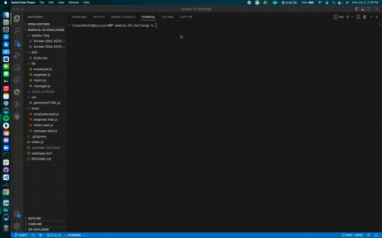

# module-10-homework

## Description
The challenge for this module was to build a Node.js command-line application that takes information about employees on a software engineering 
team and generates an HTML webpage that displays user inputed information for each person. Also writing unit tests for each part of my code.

I used javascript and the inquirer package 8.2.4

## Screenshots of application in command line


## Screenrecording
Video [Here](https://www.youtube.com/watch?v=Sd118D_O3Gw&ab_channel=QuincyClaytor)



## Installation
To install, run this command:
```
npm i
```
## Usage
This command-line application dynamically generates a HTML from a user's input. The application will be invoked with the following command:
```
node index.js
```
The user will be prompted for their GitHub username and other information in the command-line.

## Repository
GitHub [Repo](https://github.com/qclaytor30/module-10-homework)